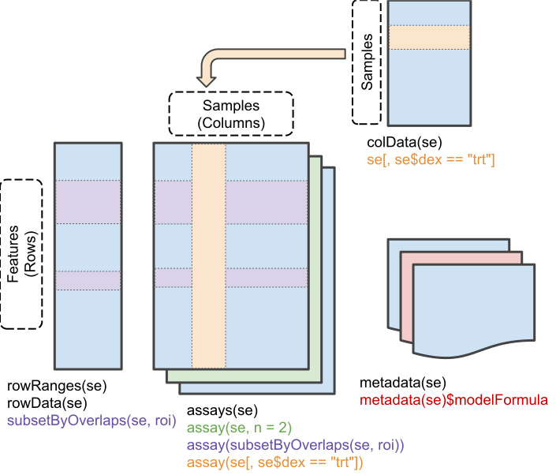

```{r style, echo=FALSE, results='asis'}
BiocStyle::markdown()
```


# Introduction 

The `SummarizedExperiment` class is used to store rectangular matrices of
experimental results, which are commonly produced by sequencing and microarray
experiments. Note that `SummarizedExperiment` can simultaneously manage several
experimental results or `assays` as long as they be of the same dimensions.

Each object stores observations of one or more samples, along
with additional meta-data describing both the observations (features) and
samples (phenotypes).

A key aspect of the `SummarizedExperiment` class is the coordination of the
meta-data and assays when subsetting. For example, if you want to exclude a
given sample you can do for both the meta-data and assay in one operation,
which ensures the meta-data and observed data will remain in sync.  Improperly
accounting for meta and observational data has resulted in a number of
incorrect results and retractions so this is a very desirable
property.

`SummarizedExperiment` is in many ways similar to the historical
`ExpressionSet`, the main distinction being that `SummarizedExperiment` is more
flexible in it's row information, allowing both `GRanges` based as well as those
described by arbitrary `DataFrame`s.  This makes it ideally suited to a variety
of experiments, particularly sequencing based experiments such as RNA-Seq and
ChIp-Seq.

#  Anatomy of a `SummarizedExperiment`

The _SummarizedExperiment_ package contains two classes: 
`SummarizedExperiment` and `RangedSummarizedExperiment`.

`SummarizedExperiment` is a matrix-like container where rows represent features
of interest (e.g. genes, transcripts, exons, etc.) and columns represent
samples. The objects contain one or more assays, each represented by a
matrix-like object of numeric or other mode. The rows of a
`SummarizedExperiment` object represent features of interest.  Information
about these features is stored in a `DataFrame` object, accessible using the
function `rowData()`. Each row of the `DataFrame` provides information on the
feature in the corresponding row of the `SummarizedExperiment` object. Columns
of the DataFrame represent different attributes of the features of interest,
e.g., gene or transcript IDs, etc.

`RangedSummarizedExperiment` is the child of the `SummarizedExperiment` class
which means that all the methods on `SummarizedExperiment` also work on a
`RangedSummarizedExperiment`.

The fundamental difference between the two classes is that the rows of a
`RangedSummarizedExperiment` object represent genomic ranges of interest
instead of a `DataFrame` of features. The `RangedSummarizedExperiment` ranges
are described by a `GRanges` or a `GRangesList` object, accessible using the
`rowRanges()` function.

The following graphic displays the class geometry and highlights the
vertical (column) and horizontal (row) relationships.



## Assays

The `airway` package contains an example dataset from an RNA-Seq experiment of
read counts per gene for airway smooth muscles.  These data are stored
in a `RangedSummarizedExperiment` object which contains 8 different
experimental and assays 64,102 gene transcripts.

```{r, echo=FALSE}
suppressPackageStartupMessages(library(SummarizedExperiment))
suppressPackageStartupMessages(data(airway, package="airway"))
```

```{r}
library(SummarizedExperiment)
data(airway, package="airway")
se <- airway
se
```

To retrieve the experiment data from a `SummarizedExperiment` object one can
use the `assays()` accessor.  An object can have multiple assay datasets
each of which can be accessed using the `$` operator.
The `airway` dataset contains only one assay (`counts`).  Here each row
represents a gene transcript and each column one of the samples.

```{r assays, eval = FALSE}
assays(se)$counts
```

```{r assays_table, echo = FALSE}
knitr::kable(assays(se)$counts[1:10,])
```

## 'Row' (regions-of-interest) data
The `rowRanges()` accessor is used to view the range information for a
`RangedSummarizedExperiment`. (Note if this were the parent 
`SummarizedExperiment` class we'd use `rowData()`). The data are stored in a 
`GRangesList` object, where each list element corresponds to one gene 
transcript and the ranges in each `GRanges` correspond to the exons in the
transcript.

```{r rowRanges}
rowRanges(se)
```

## 'Column' (sample) data

Sample meta-data describing the samples can be accessed using `colData()`, and
is a `DataFrame` that can store any number of descriptive columns for each
sample row.

```{r colData}
colData(se)
```

This sample metadata can be accessed using the `$` accessor which makes it 
easy to subset the entire object by a given phenotype.

```{r columnSubset}
# subset for only those samples treated with dexamethasone
se[, se$dex == "trt"]
```

## Experiment-wide metadata

Meta-data describing the experimental methods and publication references can be
accessed using `metadata()`.

```{r metadata}
metadata(se)
```

Note that `metadata()` is just a simple list, so it is appropriate for _any_
experiment wide metadata the user wishes to save, such as storing model
formulas.

```{r metadata-formula}
metadata(se)$formula <- counts ~ dex + albut

metadata(se)
```

# Constructing a `SummarizedExperiment` 

Often, `SummarizedExperiment` or `RangedSummarizedExperiment` objects are 
returned by functions written by other packages. However it is possible to 
create them by hand with a call to the `SummarizedExperiment()` constructor.

Constructing a `RangedSummarizedExperiment` with a `GRanges` as the
_rowRanges_ argument:

```{r constructRSE}
nrows <- 200
ncols <- 6
counts <- matrix(runif(nrows * ncols, 1, 1e4), nrows)
rowRanges <- GRanges(rep(c("chr1", "chr2"), c(50, 150)),
                     IRanges(floor(runif(200, 1e5, 1e6)), width=100),
                     strand=sample(c("+", "-"), 200, TRUE),
                     feature_id=sprintf("ID%03d", 1:200))
colData <- DataFrame(Treatment=rep(c("ChIP", "Input"), 3),
                     row.names=LETTERS[1:6])

SummarizedExperiment(assays=list(counts=counts),
                     rowRanges=rowRanges, colData=colData)
```

A `SummarizedExperiment` can be constructed with or without supplying
a `DataFrame` for the _rowData_ argument:

```{r constructSE}
SummarizedExperiment(assays=list(counts=counts), colData=colData)
```

# Common operations on `SummarizedExperiment`

## Subsetting

- `[` Performs two dimensional subsetting, just like subsetting a matrix
    or data frame.
```{r 2d}
# subset the first five transcripts and first three samples
se[1:5, 1:3]
```
- `$` operates on `colData()` columns, for easy sample extraction.
```{r colDataExtraction}
se[, se$cell == "N61311"]
```

## Getters and setters

- `rowRanges()` / (`rowData()`), `colData()`, `metadata()`
```{r getSet}
counts <- matrix(1:15, 5, 3, dimnames=list(LETTERS[1:5], LETTERS[1:3]))

dates <- SummarizedExperiment(assays=list(counts=counts),
                              rowData=DataFrame(month=month.name[1:5], day=1:5))

# Subset all January assays
dates[rowData(dates)$month == "January", ]
```

- `assay()` versus `assays()`
There are two accessor functions for extracting the assay data from a
`SummarizedExperiment` object.  `assays()` operates on the entire list of assay
data as a whole, while `assay()` operates on only one assay at a time.
`assay(x, i)` is simply a convenience function which is equivalent to
`assays(x)[[i]]`.

```{r assay_assays}
assays(se)

assays(se)[[1]][1:5, 1:5]

# assay defaults to the first assay if no i is given
assay(se)[1:5, 1:5]

assay(se, 1)[1:5, 1:5]
```

## Range-based operations

- `subsetByOverlaps()`
`SummarizedExperiment` objects support all of the `findOverlaps()` methods and
associated functions.  This includes `subsetByOverlaps()`, which makes it easy
to subset a `SummarizedExperiment` object by an interval.

```{r overlap}
# Subset for only rows which are in the interval 100,000 to 110,000 of
# chromosome 1
roi <- GRanges(seqnames="1", ranges=100000:1100000)
subsetByOverlaps(se, roi)
```

# Session information

```{r}
sessionInfo()
```
